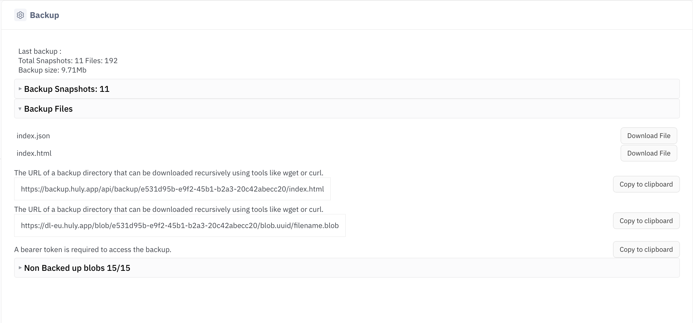

# Импорт и восстановление бэкапа

Скачайте бэкап рабочего пространства из облачного Huly и разверните его в вашей
self-hosted Платформе.

> English version: [backup-import.en.md](backup-import.en.md)

## Обзор

Самый простой путь - интерактивный мастер `import-from-huly.sh`, проводящий
через все шаги. Внутри использует:

- `import-backup.mjs` - скачивает все файлы бэкапа **и большие блобы** рабочего
  пространства (с повторами, докачкой и прогресс-баром).
- `create-workspace.sh` - создаёт локальное рабочее пространство (технический
  admin-владелец создаётся автоматически).
- `backup-restore.sh` - восстанавливает данные и оригинальных пользователей,
  заливает блобы в локальный datalake.

Все параметры подключения берутся из `config/platform.conf` (создаётся `setup.sh`).

## Шаг 0. Подготовка

Платформа должна быть запущена (`./up.sh`).

> [!IMPORTANT]
> Создавать пользователя **не нужно**. Оригинальные пользователи из бэкапа
> восстанавливаются автоматически. Для создания пространства заводится
> технический admin-аккаунт (`admin@platform.local`); его случайный пароль
> сохраняется в `config/.admin.secret`.
>
> Пользователи входят по email, поэтому платформа должна уметь отправлять почту.
>
> **Только демо-сетап:** из коробки почта перехватывается локальным ящиком
> **Mailpit** (не уходит в реальный интернет) - читайте код входа (OTP) там:
>
> ```
> http://<хост>:8025
> ```
>
> (Порт - `MAILPIT_HTTP_PORT` в `config/platform.conf`, по умолчанию `8025`.)
>
> **Production:** Mailpit только для тестов. Настройте реальный SMTP-сервер, чтобы
> пользователи получали письма с OTP - см. раздел "Production SMTP" в README.

## Шаг 1. Получить URL бэкапа и токен

Откройте рабочее пространство в web-приложении Huly и перейдите в настройки
бэкапа:



```
https://huly.app/workbench/<workspace>/setting/setting/backup
```

На странице (**Settings -> Backup -> Backup Files**):

1. В блоке **The URL of a backup directory...** нажмите **Copy to clipboard** -
   получите URL, например
   `https://backup.huly.app/api/backup/<id-пространства>/index.html`.
2. Рядом с **A bearer token is required to access the backup** нажмите
   **Copy to clipboard** - получите токен.

> [!TIP]
> На этой же странице видна статистика бэкапа (снапшоты, число файлов, размер) и
> прямое скачивание `index.json` / `index.html` для проверки доступа.

> [!NOTE]
> Huly делает бэкап примерно **раз в 12 часов**, поэтому последний бэкап может
> отставать от живого пространства до 12 часов. Сверьтесь со временем "Last
> backup" на странице перед импортом.

## Шаг 2. Запустить мастер

```bash
./import-from-huly.sh
```

Мастер спросит всего две вещи:

1. **URL бэкапа** (вставьте из Шага 1).
2. **Bearer токен** (вставьте из Шага 1, ввод скрыт).
3. **Имя пространства** - любое понятное имя (не UUID), например `my-team`.

Далее мастер скачает бэкап + блобы, создаст пространство, восстановит данные
(включая оригинальных пользователей через `--accounts`) и зальёт блобы. По
завершении пользователи входят по email (OTP в Mailpit).

## Ручные шаги (для продвинутых)

```bash
# 1. Скачать в папку по UUID (backups/<huly-ws-uuid>).
#    Повторный запуск переиспользует уже скачанное - ничего не удаляется.
node import-backup.mjs --url https://backup.huly.app/api/backup/<ws-uuid>/index.html \
  --token-file ./token.txt        # по умолчанию --out = ./backups/<ws-uuid>
#    Опционально: ограничить размер блобов, например пропустить больше 50MB:
#    node import-backup.mjs ... --max-blob-size 50

# 2. Создать локальное пространство (технический admin-владелец создаётся сам)
./create-workspace.sh my-team
#    (или существующий аккаунт: --owner-email user@example.com)

# 3. Восстановить данные + аккаунты + залить блобы
./backup-restore.sh ./backups/<ws-uuid> my-team
#    (добавьте --no-accounts чтобы НЕ восстанавливать пользователей из бэкапа)
```

> [!NOTE]
> Скачанное хранится в `backups/<huly-workspace-uuid>/`, а не под выбранным
> локальным именем. Другое имя при повторном запуске переиспользует ту же
> загрузку. Скачанные файлы никогда не удаляются.

## Решение проблем

- **401 Unauthorized при скачивании** - токен истёк или вы не владелец/админ.
  Получите свежий токен (Шаг 1).
- **Не приходит письмо** - в демо-сетапе смотрите Mailpit
  (`http://<хост>:8025`), не реальный ящик. В production убедитесь что настроен
  реальный SMTP (см. README "Production SMTP").
- **Network `<name>_platform_net` not found** - платформа не запущена
  (`./up.sh`).
- **Blob upload FAIL** - datalake должен быть доступен на `localhost:4031`;
  проверьте `datalake` и `minio`.
